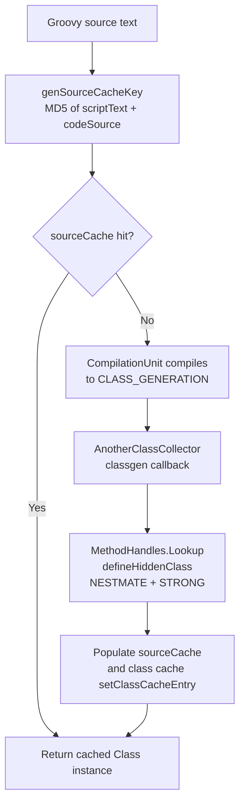

# User Manual

[English](MANUAL_en.md) | [中文](MANUAL.md)

This document describes how `GroovyHiddenClassLoader` works, how to use it, and its constraints. See [README_en.md](README_en.md) for background and [CHANGELOG_en.md](CHANGELOG_en.md) for changes.

## 1. How it works



Key points:

1. `parseClass(String, String)` overrides the parent implementation: it computes the MD5 cache key first and compiles only on a miss.
2. The compiled bytes no longer go through `ClassLoader#defineClass`; instead `AnotherClassCollector.createClass` calls `lookup.defineHiddenClass`.
3. `NESTMATE` makes the hidden class a nestmate of the anchor class so it can access package-private members; `STRONG` prevents premature collection.

## 2. Usage

```java
CompilerConfiguration config = new CompilerConfiguration();
config.setSourceEncoding("UTF-8");

GroovyClassLoader loader =
        new GroovyHiddenClassLoader(Thread.currentThread().getContextClassLoader(), config, false);

Class<?> clazz = loader.parseClass(scriptText, "demo.groovy");
Object instance = clazz.getDeclaredConstructor().newInstance();
```

Recommended script shape (a complete class definition, as in `GroovyHiddenClassLoaderTest`):

```groovy
package cn.itcraft.ch4gn.groovy
class demo1 implements cn.itcraft.ch4gn.groovy.GroovyHiddenClassLoaderTest$DemoInterface {
    def boolean demo(String name, int age){ name.length() > 5 && age > 12 }
}
```

## 3. Limitations

### 3.1 Must be a complete Groovy class

The supplied source must be a complete Groovy unit (a full class definition). A bare method cannot be compiled, for example:

```groovy
def judge(name, age) { name.length() > 5 && age > 12 }
```

This fails to compile and reports a **class initialization failure** at runtime. A hidden class requires an explicit class name and class node before `defineHiddenClass` can define it; a bare method fragment produces no usable main class.

### 3.2 The package must match the anchor

Because the Hidden Class feature requires an anchor for the class loader and lookup context, the script's `package` must match the anchor:

```
cn.itcraft.ch4gn.groovy
```

Here `ch4gn` is the abbreviation of `class-hidden-4-groovy-new` (ch4gn = class-hidden 4 groovy new). If the package differs, definition fails and a class-initialization exception is raised.

## 4. Purpose and positioning

### 4.1 What it is for

- Leverages the **hidden mode** to create lighter classes: a hidden class never enters the loader's type lookup tables and is not a normally discoverable named type, so Metaspace usage stays small.
- Enables **hot swap of same-named code**: every compilation produces a new hidden class instance, so multiple versions of one name coexist and the logic of a same-named class can be replaced without a restart.

### 4.2 Lifecycle trade-off

In terms of lifecycle, this approach is **inferior to lambda classes under JDK 8**: classes generated by `LambdaMetafactory` are held by a `ClassLoader`, so their lifetime is bound to that loader and they are reclaimed together with it. Hidden classes, by contrast, survive through the `MethodHandles.Lookup` and strong references held by callers. The `STRONG` option prevents premature collection, but there is no such clear "batch unload together with the host class loader" semantics as with JDK 8 lambdas. For long-lived, batch-reclaimed scenarios, lifecycle management is therefore weaker than that of JDK 8 lambda classes.

## 5. Troubleshooting

| Symptom | Cause | Fix |
| --- | --- | --- |
| "class initialization failure" during compilation | Source is not a complete class, e.g. only `def judge(...)` | Complete it into a full `class X { ... }` definition |
| Definition failure / initialization exception | `package` differs from the anchor `cn.itcraft.ch4gn.groovy` | Align the script package with the anchor package |
| Same source keeps occupying Metaspace | The `parseClass` cache was bypassed | Always go through `parseClass` and reuse the MD5 cache key |

## 6. Related documents

- [README_en.md](README_en.md)
- [CHANGELOG_en.md](CHANGELOG_en.md)
- [MANUAL.md](MANUAL.md)
